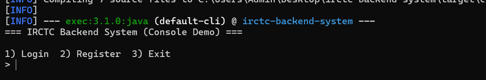

# IRCTC Backend System (Console Demo)

A **Core Java backend simulation** of the IRCTC train reservation system.  
Built to demonstrate clean object-oriented design, modular structure, and Java Collections usage.  

---

## Overview

This project models the core functionalities of an Indian railway booking backend using Java and Maven.  
It allows users to register, log in, view available trains, search by route, book or cancel tickets, and view their bookings — all through a console-based interface.

---

## Features

- **User Authentication**
  - Register and log in with simple credentials (in-memory users)
- **Train Management**
  - Search trains by source, destination, and date
  - View available trains with real-time seat tracking
- **Booking System**
  - Reserve and cancel tickets
  - Auto-generate PNR numbers for each booking
  - Seat count auto-updates after each booking/cancellation
- **Collections & Data Handling**
  - Uses `ArrayList`, `HashMap`, and synchronization for data consistency
- **Clean Architecture**
  - Separated into `model`, `service`, and `util` layers for scalability

---

## Project Structure

irctc-backend-system/
├── pom.xml
├── README.md
└── src/
└── main/
└── java/
└── com/
└── hariish/
└── irctc/
├── model/
│ ├── Train.java
│ ├── Ticket.java
│ └── User.java
├── service/
│ ├── TrainService.java
│ └── BookingService.java
├── util/
│ └── DataStore.java
└── Main.java

---

## Example Console Session

=== IRCTC Backend System (Console Demo) ===

Login 2) Register 3) Exit

1
username: hari
password: password123
Welcome, Hariish S (hari)

--- MENU (user: hari) ---

List all trains

Search trains by source,destination,date(YYYY-MM-DD)

Book train

View my bookings

Cancel booking (by PNR)

Logout

Exit

1
Available trains:
T1001 | Coastal Express | Chennai -> Bengaluru | 2025-10-18 | seats: 120 | fare: 450.00

---

## Console Demo

---

## Tech Stack

| Layer | Technology |
| :------------- | :-------------------------------------------------- |
| Language | Java 11 |
| Build Tool | Maven |
| Paradigm | Object-Oriented Programming |
| Core Libraries | Java Collections Framework (`ArrayList`, `HashMap`) |
| Architecture | Modular (Model–Service–Util) |
| Execution | Console-based Application |

---

## Future Enhancements

- Integrate JDBC or MySQL for persistence  
- Add admin management for train schedule  
- Support date validation and seat limits  
- Extend to REST API using Spring Boot (next version)

---

## Author  

**Hariish Srinivasan**  
Built as part of a series of recruiter-ready Core Java projects for SDE-1 preparation.  
Demonstrates modular design, data handling, and console-based backend simulation.
